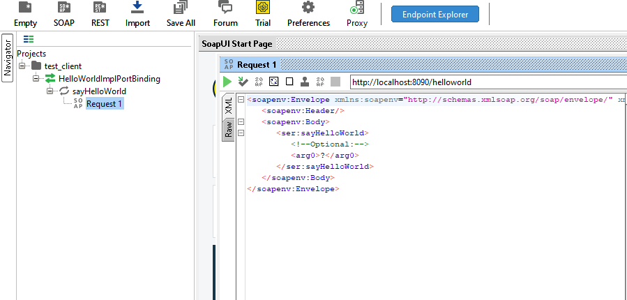

# Lab05 - SOEN 487 #

This is the Lab template for [Tutorial 5](https://github.com/SOEN487/T05).

You should watch the video for Tutorial 5 and clone [Tutorial 5](https://github.com/SOEN487/T05) before starting the lab. 

We encourage you to use either IntelliJ IDE or maven from command line in order to get the best support from our TAs.

## Existing Classes ##

1. **[ServicePublisher](src/main/java/SOAP/endpoint/ServicePublisher.java)** class that publishes the generated WSDL file on an http server.

2. **[Customer](src/main/java/SOAP/service/Customer.java)** Base class similar to HelloWorld in T05

3. **[CustomerImpl](src/main/java/SOAP/service/CustomerImpl.java)** Base class similar to HelloWorldImpl in T05

Note: You will need to replace the sayHelloWorld and add the methods that are provided in your Lab instructions.

## IntelliJ Instructions ##

When importing the project in IntelliJ, you can go to File -> New -> Project From Existing Sources... and use the existing pom.xml file to initialize the project.

Follow the tutorial on how to setup the service classes and the publisher. When they are done, right click on the ServicePublisher and choose Run main().

## Maven Instructions ##

    Run the folllowing commands in the associated project directory:

    Compile:
        mvn install
    Run (ServicePublisher)
        mvn exec:java -Ppublisher
    Clean:
        mvn clean

## Soap UI Testing ##

To test with SoapUI, run the program and click on new SOAP project. While ServicePublisher is still running, enter a project name and copy the WSDL url in the initial WSDL field.

You can now open requests from the navigator on the left, edit the message and send a SOAP request to the server to get a response. To submit the request, click on the green play button.

